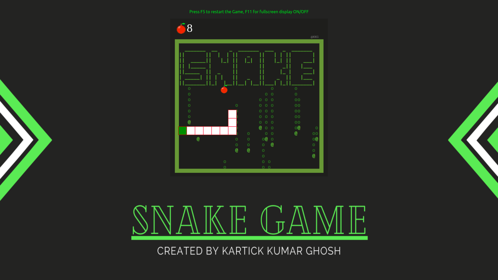

Classic Arcade-Snake Game
By Kartick Kumar Ghosh

Project Description: This game has a board and a snake. There are food items on the board for the snake to consume. The snake moves around on the board and eats the food piece. As it consumes the food piece a new piece is created on the board and the snake length increases by 1. The user can control the direction of the snake with arrow keys. The player cannot stop the snake from moving while the game is in progress, and cannot make the snake go in reverse. If the snake head touches itself or the walls it dies.

Project Files : 
1. Audio folder that contains all the audios used in the game 
2. Image folder that contains all the images used in the game except the main background image
3. "bendi.png" which is the main background image
4. "index.html" that is the html file
5. "snake.js" that contains all the javascript codes
6. "styles.css" that contains all the css codes

Tools/Languages used : HTML, CSS and Javascript

